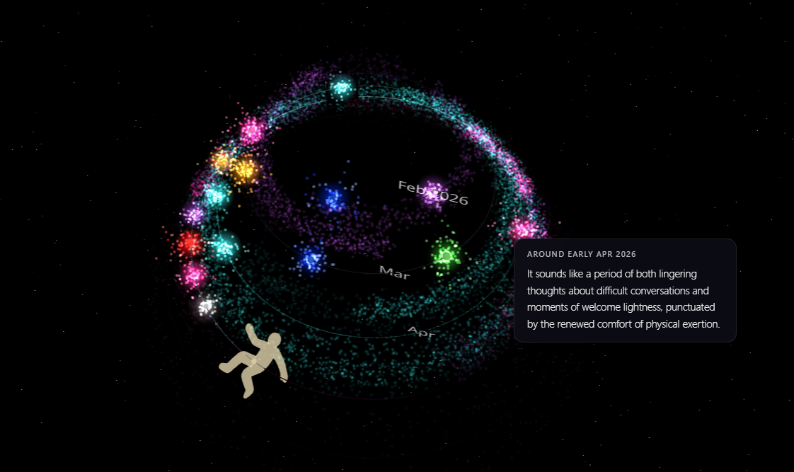
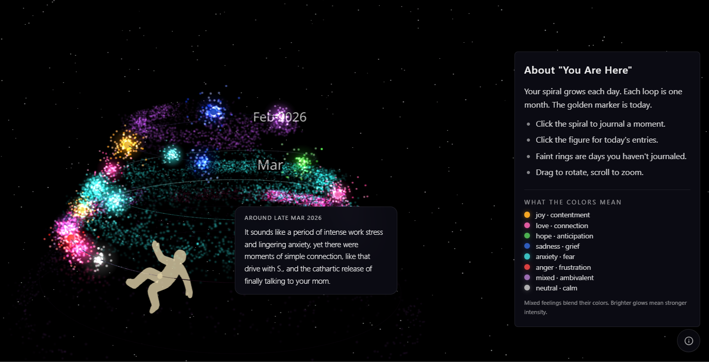

# You're Here

A reflective spiral journal where the interface is the art. You write or speak naturally, and AI maps your entries onto a growing 3D spiral as colored particle clusters. No mood pickers, no forms, no sliders. Just you, thinking out loud — and the spiral paints itself.

This is a creative sprint project. It started from a simple question about awareness.

> **No hosted demo.** Clone the repo and run it locally with your own API keys (see [Getting Started](#getting-started)). This project is meant to be run on your own machine — your entries stay in your browser, your keys stay on your bill.


---

## Why This Exists

The other day someone asked me, "Is *Feeling Good* the only book you ever read?"

Well, no. But it's the one I remember the most clearly. Because it doesn't try to sell you an idea and ask you to figure it out. It hands you tools. And my favorite part of these tools is that they're not aiming to *solve*. They're tools to make you *aware*. Without being aware, you can't figure things out on your own, or can't properly apply other tools.

That difference — between solving and seeing — ended up shaping how I move through things. So it's not surprising that out of dozens of tiny project ideas scattered across my notes, this is the one I chose to build.

The glowing spiral you see here is called **You're Here**.

It's a cosmic mood journal built on two foundations:

**David D. Burns' memory reflection exercise from *Feeling Good*.** In it, you're asked to recall a moment when you felt particularly bad or surprisingly good, and try to step fully back into that moment. What usually happens is, you can't. There's a gap between the intensity of the emotion and your current awareness — you can't truly reconstruct it when you're no longer in that state. That gap between memory and emotion becomes data, and it changes how you relate to memory itself.

**A very human need to feel anchored while still floating — but not being stuck.** So I made a place for that. Where the center isn't *what* happened, but *how it felt*. Where you can place something in a single moment, or stretched across a time period, and see it alongside everything else.

It isn't about avoiding what we prefer to call "bad." In fact, it's partly about honoring it — letting it take its place in the map. Because when you place it, you can see it. It's real, it happened, and it passed. You don't fall into what Burns calls the *mental filter* — only remembering the hard parts and letting them color everything else.

When you place them next to the moments that felt warm or weird or okay, you get a wider view. You start to see that even in chaos, there were other moments too.

Just tracking your thoughts and feelings begins to shift how they sit in your mind, in a way that gives you perspective. And once you have perspective, you're not trapped inside it anymore.

You're here.

---

## What the AI Does

The spiral's colors, intensity, and shape are never chosen by you — they're derived by AI from your writing. You just think out loud.

### Sentiment Analysis
When you submit an entry, Gemini analyzes your text for emotional content. It handles nuance: *"I keep telling myself it's fine but I can't sleep"* is anxiety, not positivity. Mixed emotions are valid — joy and sadness can coexist, and the spiral shows that through blended colors.

| What you feel | How it looks |
|---|---|
| Joy, contentment | Warm yellows, oranges |
| Sadness, grief | Deep blues |
| Anger, frustration | Reds |
| Anxiety, fear | Cool teals, cyans |
| Love, connection | Warm pinks, magentas |
| Hope, anticipation | Greens |
| Mixed, ambivalent | Blended purples |
| Neutral, calm | Soft whites, grays |



### AI-Defined Time Periods
You only ever pick *one* date — the anchor, where the entry lives on the spiral. Gemini reads your text and decides how far that feeling actually stretches:

- *"today I felt..."* → a single point on the spiral
- *"since that day I've been..."* → a colored smear from the anchor to today
- *"for the past two weeks..."* → smear pulled across the implied window
- *"until the move next Friday..."* → smear that ends when the event ends
- *"next month I'm nervous about..."* → diffuse, ghostly particles projected into the future

You don't pick start/end dates. You don't classify anything as "past" or "future." The model infers the temporal scope (`point`, `smear`, or `forward`) and the end date from your wording. Anything beyond today renders lighter and more transparent — the future is ghostly, the past is vivid.

### The Now Anchor
A small floating figure marks **today** on the spiral — the "you are here" pin that gives the project its name. Wherever you orbit the camera, the figure stays facing you so you can always tell where the present is. Past entries spiral inward and downward from the figure; forward projections drift out ahead of it.

### Region Summaries
Hover over any part of the spiral and the AI reflects on that time period — a warm, observational summary of what you were going through. Summaries are generated once and cached, so re-hovering feels instant.

### Speech-to-Text *(optional)*
Hit the microphone button and speak. Whisper transcribes your voice into text, so you can journal by thinking out loud — literally. The app runs fine without this — if no Groq key is set, the mic button is a no-op and you can still type entries normally.

---

## Getting Started

```sh
git clone https://github.com/tuirk/youre-here.git
cd youre-here
npm install
cp .env.example .env   # add your API keys
npm run dev
```

Open [http://localhost:5174](http://localhost:5174).

### Environment Variables

| Variable | Required | Description |
|---|---|---|
| `VITE_GEMINI_API_KEY` | Recommended | [Gemini API key](https://aistudio.google.com/apikey) for sentiment + temporal analysis and region summaries |
| `VITE_GROQ_API_KEY` | Optional | [Groq API key](https://console.groq.com) for Whisper speech-to-text |

**Running without a Gemini key:** the app still works — you can place entries on the spiral and read them back in the journal — but each entry renders as a dim, uncolored point at its anchor date. No color, no smear, no forward projection, no region summaries. Gemini is what turns the spiral into a map; without it, you get a plain timeline with text attached.

On first visit with no entries, the spiral loads with demo data spanning ~5 months — overlapping feelings, recurring themes, and forward projections — so you can see what a lived-in spiral looks like.

---

## Tech Stack

- **React** + **TypeScript** + **Vite**
- **Three.js** (react-three-fiber) — 3D spiral visualization
- **Tailwind CSS** + **shadcn/ui** — dark cosmic UI
- **Gemini API** — sentiment analysis, temporal parsing, region summaries
- **Whisper** (via Groq) — speech-to-text

---

## License

[MIT](LICENSE) &copy; 2026 tuirk

